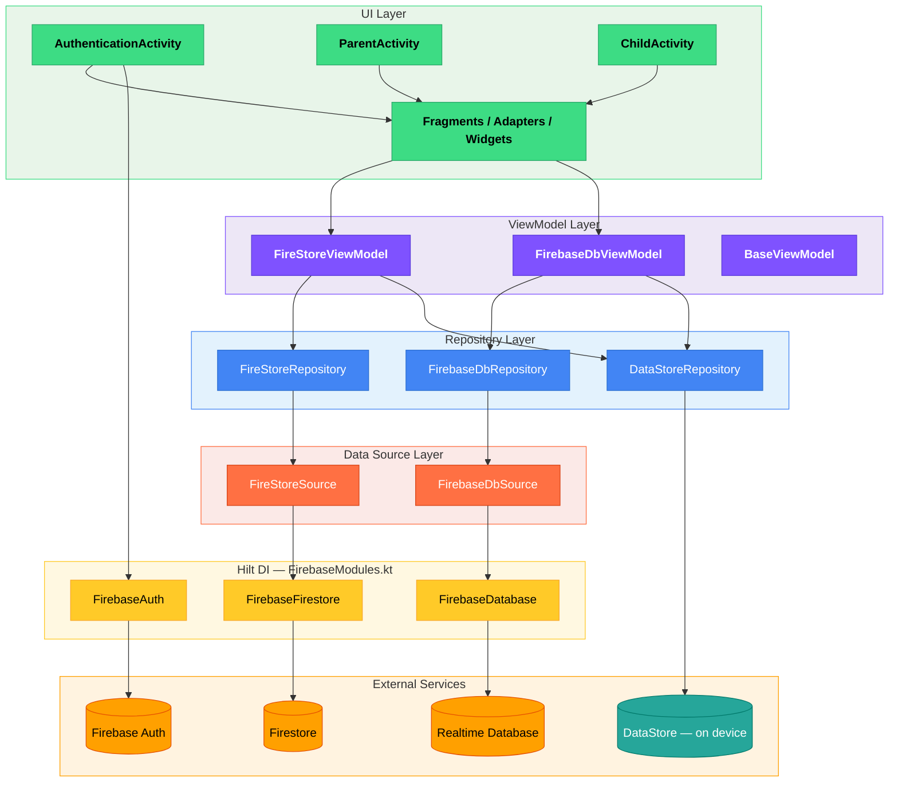
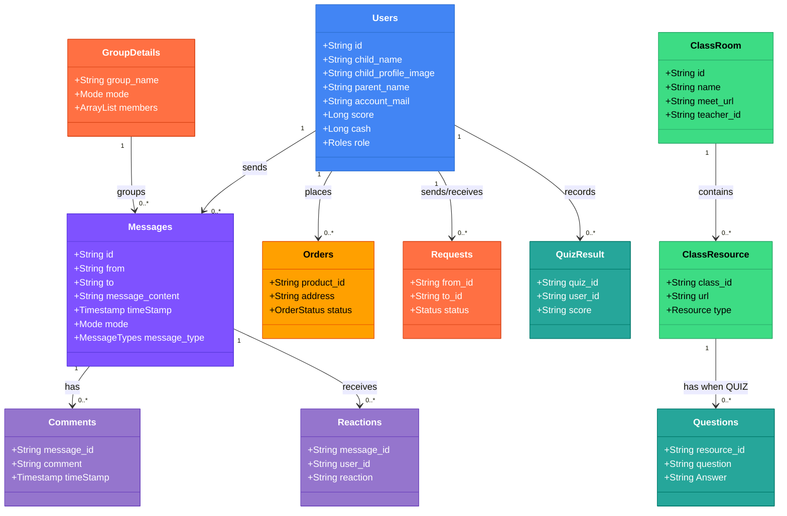
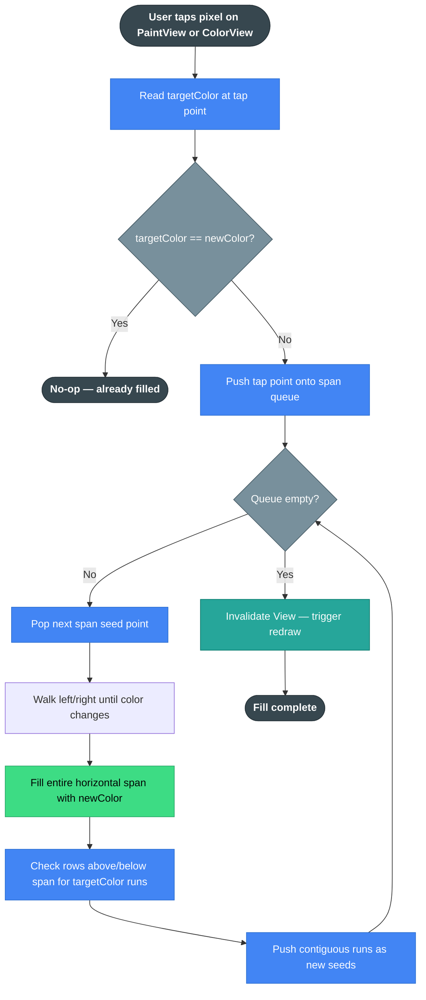
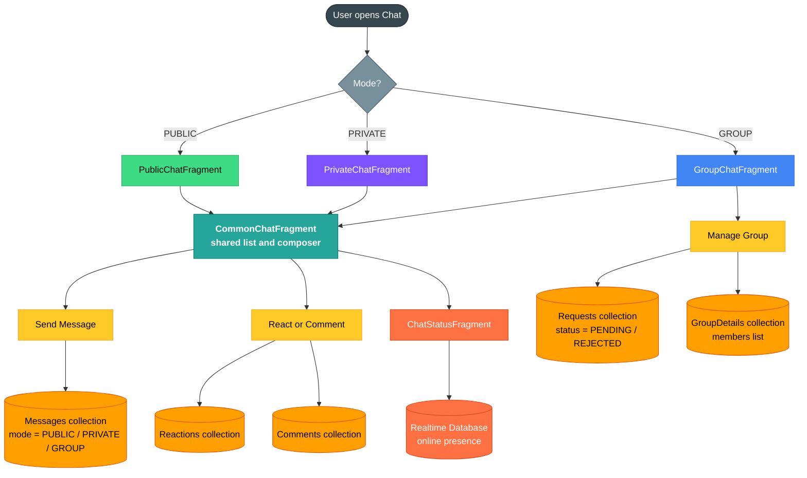
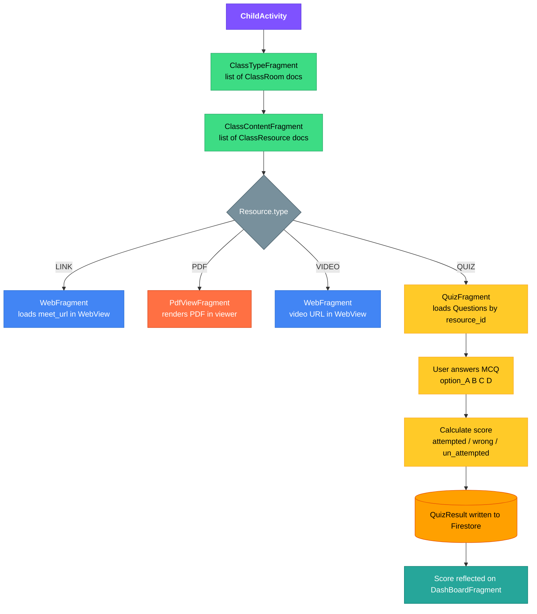

# FunlearnV2

[](https://developer.android.com)
[](https://kotlinlang.org)
[](https://github.com/JetBrains/kotlin/releases/tag/v1.4.21)
[](https://developer.android.com/studio/releases/platforms)
[](https://developer.android.com/studio/releases/platforms)
[](https://firebase.google.com)
[](https://dagger.dev/hilt)
[](https://gradle.org)
[](https://developers.google.com/ml-kit)
[](LICENSE)
[](CONTRIBUTING.md)

**FunlearnV2** is a from-scratch Kotlin rebuild of the original [FunLearn](https://github.com/PRADEEPERIYASAMY/FunLearn) — a two-sided (parent/child) Android learning platform covering tutorials, games, coloring, chat, classrooms and quizzes.

Where V1 proved the product concept end-to-end as a solo build, V2 is a deliberate architecture upgrade: dependency injection, a layered repository/ViewModel structure, typed local storage, and role-based navigation.

FunlearnV2 began as a proposed project for **Delta Winter of Code (DWoC)**, an initiative run by [Delta](https://delta.nitt.edu), NIT Trichy's software development club.

## Table of Contents

1. [What Changed from V1](#1-what-changed-from-v1)
2. [Architecture](#2-architecture)
3. [Tech Stack](#3-tech-stack)
4. [Feature Notes](#4-feature-notes)
5. [Module Reference](#5-module-reference)
6. [Roadmap](#6-roadmap)
7. [Getting Started](#7-getting-started)
8. [Firebase Setup](#8-firebase-setup)
9. [Local Development Guide](#9-local-development-guide)
10. [Contributing & Community](#10-contributing--community)

## Asset Preview

Static art assets from `res/drawable/`.

<table>
<tr>
<td align="center"><br/><sub>Tic-Tac-Toe game board asset</sub></td>
<td align="center"><br/><sub>Game background</sub></td>
<td align="center">


<br/><sub>Chess piece set (GameFourFragment)</sub></td>
</tr>
</table>

## 1. What Changed from V1

| Concern | FunLearn V1 | FunlearnV2 | Why it matters |
|---|---|---|---|
| Language | Java | Kotlin, full rewrite | Coroutines/Flow-native repository layer |
| Navigation | 42 Activities, `Intent`-extra passing | 4 host Activities + Fragments, Navigation Component + Safe Args | Type-safe transitions, shared back-stack per role |
| Dependency management | Manual wiring | Hilt across ViewModels, repositories, Firebase sources (`FirebaseModules.kt`) | Testable, swappable dependencies |
| Backend | Realtime DB only | Realtime DB for presence/light data + Firestore for structured, queryable collections | Firestore's query model fits chat/classroom/quiz data |
| Local storage | Raw `SQLiteOpenHelper` | Jetpack DataStore (`DataStoreRepository.kt`), coroutine-native typed preferences | Cleaner reads/writes, no manual cursor handling |
| Account model | No parent/child distinction | Explicit `Roles` enum + separate `ParentActivity`/`ChildActivity` entry points, phone-verified parent accounts | Matches how the product is actually used |
| Async | RxJava2 | Kotlin Coroutines + Flow-based repositories | Idiomatic Kotlin, sealed `viewmodels/actions` state contracts |
| Image loading | Glide + Picasso both present | Glide only | One dependency, one caching behavior |

## 2. Architecture

The app follows a strict layered structure: **UI (Activities/Fragments) → ViewModels → Repositories → Data Sources → Firebase / DataStore**. Every layer is injected via Hilt and talks only to its immediate neighbour — ViewModels never hold a `Context`, and Fragments never call Firebase directly.



### Entry Points

Four Activity-level entry points, all gated by authentication state:

| Activity | Role | Hosted Fragments |
|----------|------|-----------------|
| `AuthenticationActivity` | Unauthenticated launcher | `SignInFragment`, `SignUpFragment`, `UserTypeFragment` |
| `ParentActivity` | Authenticated, role = PARENT | `ParentDashBoardFragment`, `ParentVerificationFragment`, settings, chat |
| `ChildActivity` | Authenticated, role = CHILD | `DashBoardFragment`, games, tutorials, coloring, chat, quiz |
| `BaseActivity` | Shared base | Not navigated to directly — provides common setup |

`AuthenticationActivity` writes a `Users` document with a `Roles` enum (`PARENT`/`CHILD`) on signup, then routes to the appropriate host Activity. Role-based routing is done via an explicit `startActivity` call post-authentication, not inside the Navigation graph, keeping the four host Activities as hard boundaries.

### Dependency Injection

Hilt is the DI framework. `FirebaseModules.kt` is the only place Firebase client instances are constructed:

```kotlin
@Module
@InstallIn(SingletonComponent::class)
object FirebaseModules {
    @Provides @Singleton fun provideFirebaseAuth(): FirebaseAuth = FirebaseAuth.getInstance()
    @Provides @Singleton fun provideFirestore(): FirebaseFirestore = FirebaseFirestore.getInstance()
    @Provides @Singleton fun provideFirebaseDatabase(): FirebaseDatabase = FirebaseDatabase.getInstance()
}
```

Repositories receive these instances by constructor injection; ViewModels receive repositories via `@HiltViewModel`. No component constructs its own dependencies.

### Firebase Backend Split

Two Firebase services are used intentionally:

- **Firestore** — structured, queryable data: `Users`, `Messages`/`Comments`/`Reactions`, `Requests`/`GroupDetails`, `ClassRoom`/`ClassResource`, `Questions`/`QuizResult`, `Products`/`Orders`, `Notifications`/`Queries`/`Stats`.
- **Realtime Database** — lightweight, low-latency data that changes frequently and needs no queries: online presence, `AlphabetImagesAndNames`, `AlphabetWords`/phrases, match data/operator images.
- **DataStore (on device)** — typed local cache for parent/child profile fields, credentials cache, and score/cash — see [§4 Local State](#local-state--datastore).



### Local State — DataStore

`DataStoreRepository` wraps a single `androidx.datastore.preferences.DataStore` instance. Every profile field (parent and child) plus `score` and `cash` is a typed preference, replacing V1's raw `SQLiteOpenHelper` `Level` table.

- **Read path:** UI renders immediately from DataStore; Firestore/RTDB catch up in the background and update DataStore, which propagates to the UI via `Flow`.
- **Write path:** User action → ViewModel → Repository → Firestore write + DataStore write, so the local cache reflects the latest state immediately.

ViewModels expose state via sealed action classes in `viewmodels/actions/` (`FireStoreAction`, `FirebaseDbAction`). Fragments observe `LiveData<...Action>` and handle each state in a `when` expression, avoiding scattered boolean flags.

### What V2 Does Not Have Yet

- Unit/integration tests — `FloodFill` and `DataStoreRepository` are the best starting points (both side-effect-isolated).
- A complete offline-first strategy — DataStore gives instant-render local cache but there's no background sync queue for offline writes.
- Formal data-ownership documentation for every Firestore collection.
- Feature-complete stub screens (some game/quiz Fragments are navigation-wired but not fully implemented).

## 3. Tech Stack

| Concern | Choice | Notes |
|---|---|---|
| Language | Kotlin | Full rewrite of the Java V1 codebase |
| DI | Hilt (`hilt-android`, `hilt-compiler`) | Wires Firebase clients, repositories, ViewModels |
| Async | Kotlin Coroutines + `kotlinx-coroutines-play-services` | `Flow`-based repository layer |
| Backend — structured data | Firestore (`firebase-firestore-ktx`) | Users, chat, classes, quizzes, orders |
| Backend — realtime/light data | Firebase Realtime Database (`firebase-database-ktx`) | Presence-style, low-latency key/value data |
| Auth | Firebase Auth (`firebase-auth-ktx`) | Email/password + phone verification |
| On-device ML | ML Kit (`ocr`), `play-services-mlkit-text-recognition` | Handwriting recognition, offline |
| Local persistence | Jetpack DataStore (Preferences) | Typed local cache, replaces V1's SQLite table |
| Navigation | Android Navigation Component + Safe Args | Type-safe Fragment transitions inside 4 host Activities |
| Networking | Retrofit2 + Gson converter | Non-Firebase HTTP needs |
| Maps/Location | `play-services-maps`, `play-services-location`, Google Places | Location-aware features |
| Image loading | Glide | Single library (Picasso dropped from V1) |
| Biometric | `androidx.biometric` | Optional local auth gate |
| Crash/Analytics | Firebase Crashlytics, Analytics | |
| UI toolkit | Material Components, ConstraintLayout, ViewBinding, RecyclerView | `viewBinding = true` enabled at module level |

Full dependency list: [`app/build.gradle`](app/build.gradle).

## 4. Feature Notes

### Roles, Parent & Child

`AuthenticationActivity` is the single launcher Activity, fronting `SignInFragment`/`SignUpFragment`/`UserTypeFragment`. After Firebase Auth, the `Roles` enum on the `Users` document routes to `ParentActivity` (with an extra `PhoneVerificationFragment` step) or straight to `ChildActivity`.

### Coloring Engine — Flood Fill

`FloodFill.kt` is an `object` singleton implementing a scanline span-queue flood-fill algorithm. It operates directly on a `Bitmap`, walking horizontal spans and queuing only the upper/lower boundary runs rather than every pixel — the same optimization used in V1, ported to Kotlin.



It drives `PaintView.kt`/`ColorView.kt` and is shared across `ColouringOneFragment`, `ColouringTwoFragment`, `ColouringThreeFragment`, plus the tracing game in `Patterns.kt`.

### Chat — Public, Private & Group

Chat uses a single set of Firestore collections with a `Mode` enum (`PRIVATE`, `PUBLIC`, `GROUP`) to distinguish conversation types on the same schema, avoiding parallel collections that would drift independently.



`ChatStatusFragment` handles real-time presence by writing to Realtime Database on foreground/background transitions.

### Quiz, Classroom & Resources



### Enums Reference

Key enums used across the models: `Roles` (PARENT/CHILD), `Mode` (PRIVATE/PUBLIC/GROUP), `Resource` (LINK/PDF/VIDEO/QUIZ), `MessageTypes` (TEXT/IMAGE/PDF/VIDEO), `Status` (PENDING/REJECTED), `OrderStatus` (PENDING/DELIVERED), `Grade` (PREKG/LKG/UKG), `ParentGrade` (SCHOOL/COLLEGE/NOCOMMENTS), `OnlineVisibility` (ONLINE/OFFLINE), `Gender` (MALE/FEMALE/NOTOSAY).

## 5. Module Reference

```
app/src/main/java/com/example/funlearnv2/
├── FirebaseSource/     FirebaseDbSource, FireStoreSource, FirebaseModules, Collections — data-source layer
├── models/             DataModel, FirebaseDbModels, FirestoreModels, chatModel, Result — data/DTO layer
├── repository/         DataStoreRepository, FireStoreRepository, FirebaseDbRepository
├── viewmodels/         BaseViewModel, FireStoreViewModel, FirebaseDbViewModel
│   └── actions/         FireStoreAction, FirebaseDbAction — sealed action/state contracts
├── utils/              CallUtil, ContextUtil, DateUtil, DialogUtil, DimensionUtil, FileUtil,
│                        FileSaveUtil, GlideUtil, HideKeyboardUtil, InputTextUtil,
│                        ProgressBarUtil, QueryUtil, SnackbarUtil, ViewGroupUtil, ViewUtil
│   ├── constants/        Constant, ButtonStatus, FunType, OperatorTypes
│   └── resourceProvider/ ResourceProvider — DataStore + resource access wrapper
├── views/
│   ├── activities/      AuthenticationActivity, BaseActivity, ParentActivity, ChildActivity
│   ├── fragments/        45 Fragments — onboarding, auth, dashboard, learn, games, coloring, chat, classroom/quiz, settings
│   ├── adapters/         16 adapters (15 RecyclerView + 1 ViewPager2), one per list-backed screen
│   └── widgets/          FloodFill, PaintView, ColorView, Patterns, GameImages
└── FunLearnApplication.kt   @HiltAndroidApp entry point
```

## 6. Roadmap

- Finish stub screens and confirm full V1→V2 parity, then retire the legacy Java module.
- Extend `DataStoreRepository` into a full offline-first cache layer, with Firestore as the sync source of truth.
- Formalize the `FirebaseDbSource`/`FireStoreSource` boundary into a documented data-ownership map.
- Add unit tests, starting with `FloodFill` and `DataStoreRepository` (both side-effect-isolated) — no test suite exists yet.
- Continue extracting game logic into ViewModels to keep game rules testable independent of the view layer.
- Replace the Asset Preview section with real screenshots and screen recordings of the running app.

## 7. Getting Started

```bash
git clone https://github.com/PRADEEPERIYASAMY/FunLearnV2.git
cd FunLearnV2
```

1. Create a Firebase project; enable **Firestore**, **Realtime Database**, **Authentication** (email/password + phone), **Crashlytics**, and **ML Kit Text Recognition**.
2. Download `google-services.json` into `app/` (a placeholder already exists in this repo; replace it with your own project's file).
3. Open the repository root in Android Studio (Gradle + `com.google.gms.google-services` + Hilt + Navigation Safe Args plugins) and let Gradle sync.
   - The project uses **JitPack** (`https://jitpack.io`) as a Maven repository for some dependencies — Android Studio adds this automatically.
4. Build:

```bash
./gradlew build
```

For full Firebase configuration, see [§8](#8-firebase-setup). For build environment details, see [§9](#9-local-development-guide).

## 8. Firebase Setup

The app depends on five Firebase services: Authentication, Firestore, Realtime Database, Crashlytics, and ML Kit Text Recognition.

1. **Create a project** at [console.firebase.google.com](https://console.firebase.google.com).
2. **Enable Authentication** — Email/Password and Phone sign-in methods.
3. **Enable Firestore and Realtime Database** in production mode with the rules below.
4. **Register the Android app** with package `com.example.funlearnv2` and download `google-services.json` into `app/`.
5. **Enable Crashlytics and ML Kit Text Recognition** from the Firebase console.

**Firestore Security Rules (starting point):**

```
rules_version = '2';
service cloud.firestore {
  match /databases/{database}/documents {
    match /Users/{userId} {
      allow read, write: if request.auth != null && request.auth.uid == userId;
    }
    match /Messages/{messageId} {
      allow read, write: if request.auth != null;
    }
    // Add rules per collection as the app matures
  }
}
```

**Realtime Database Security Rules (production):**

```json
{
  "rules": {
    ".read": "auth != null",
    ".write": "auth != null"
  }
}
```

> Start strict and open up. The test-mode default (allow all) is not safe for production.

**Troubleshooting**

- **`google-services.json` errors at sync time** — must be at `app/google-services.json` and match package `com.example.funlearnv2`.
- **Phone auth — SMS not received** — add a test phone number in Firebase Console under Authentication > Sign-in method > Phone.
- **ML Kit model not found** — clean (`./gradlew clean`) and rebuild; the model downloads on first launch and needs a network connection.
- **Crashlytics not reporting** — disabled in debug by default; force-enable with `FirebaseCrashlytics.getInstance().setCrashlyticsCollectionEnabled(true)` in `FunLearnApplication.kt`.

## 9. Local Development Guide

| Tool | Version | Notes |
|------|---------|-------|
| Android Studio | Arctic Fox (2020.3.1) or later | Hedgehog or later recommended |
| JDK | 8 (Java 1.8) | Set in `compileOptions`/`kotlinOptions` |
| Android SDK | API 30 (compile + target) | API 23 minimum |
| Gradle | Wrapper included | Use `./gradlew`, not a system install |

**Build & run:**

```bash
./gradlew assembleDebug      # Debug build
./gradlew assembleRelease    # Release build (needs signing config)
./gradlew installDebug       # Install on device/emulator
./gradlew lint               # Lint report at app/build/reports/lint-results-debug.html
./gradlew test               # Unit tests
./gradlew connectedAndroidTest  # Instrumented tests (needs a connected device/emulator)
```

**Code conventions:** ViewBinding only (no `findViewById`) · Hilt for all DI (no manual construction) · Kotlin Coroutines/Flow only (no RxJava/AsyncTask) · Glide only for images · Navigation Component + Safe Args for all Fragment transitions.

**Common issues**

- **Gradle sync fails on `google-services.json`** — see [Firebase Setup](#8-firebase-setup).
- **kapt errors** — ensure `kapt { correctErrorTypes true }` is set; try `./gradlew clean` if errors persist.
- **Safe Args not generating** — clean and rebuild; confirm the `androidx.navigation.safeargs.kotlin` plugin is applied.
- **Hilt injection failures** — Activities/Fragments must extend AndroidX base classes, and `FunLearnApplication` must be `@HiltAndroidApp`-annotated (already configured).
- **MultiDex on API 21+** — already configured via `multiDexEnabled true` and Hilt's generated Application class.

## 10. Contributing & Community

Contributions, bug reports, and feature requests are welcome.

- Read [CONTRIBUTING.md](CONTRIBUTING.md) before opening a pull request.
- Review the [Code of Conduct](CODE_OF_CONDUCT.md).
- Report security issues privately via [SECURITY.md](SECURITY.md).
- Need help? See [SUPPORT.md](SUPPORT.md).
- Use the issue templates when filing bugs or feature requests.

This project is primarily a solo build. If you want to contribute, open an issue first to discuss scope before writing code.

Licensed under [MIT](LICENSE).

---

Made with ❤️ by Pradeep Periyasamy
